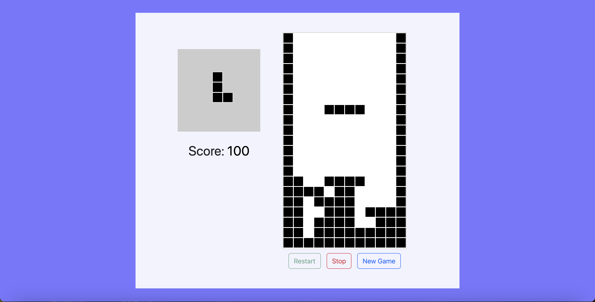

# Tetris Game

This project implements a Tetris-like game using HTML, CSS, and JavaScript.

## Features

- **Game Display:** Includes a score counter and game over message.
- **Audio:** Background music and sound effects for score updates and high scores.
- **Buttons:** Buttons for restarting, stopping, and starting a new game.
- **Responsive Design:** Utilizes Bootstrap for responsive layout and styling.

## How to Play

1. **Start the Game:** The game automatically begins upon loading, accompanied by background music.
   - **Left Arrow:** Move the falling block left.
   - **Right Arrow:** Move the falling block right.
   - **Up Arrow:** Rotate the falling block.
   - **Down Arrow:** Drop the falling block faster.
2. **Scoring:** Earn points by clearing lines with falling blocks.
3. **Game Over:** The game ends when the blocks reach the top of the screen.

## Installation

To run the game locally:

1. Clone this repository.
2. Open `index.html` in your web browser.
